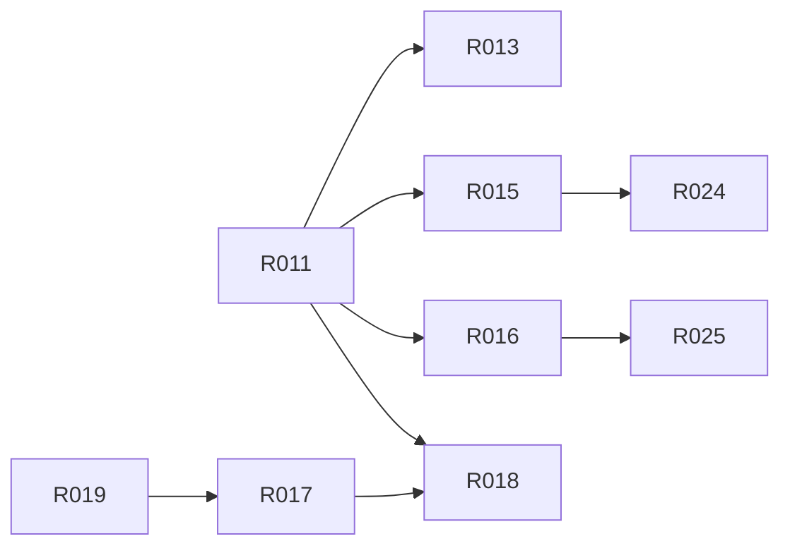
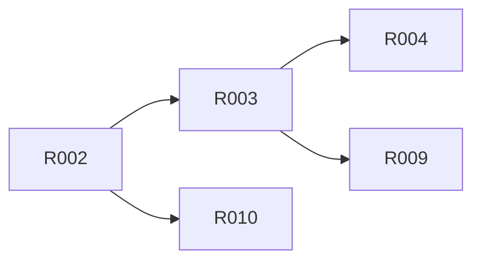
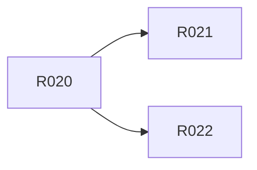

# 依赖图谱

> **本页由 `pact-book.sh` 从 `PACT.md` 自动生成，请勿手改。**
> 改内容请改 `PACT.md`，然后重新 `pact-book.sh --build`；`--check` 会抓出手改导致的漂移。

> 全量 27 个节点的图没人看得懂，因此**按里程碑分图**；单条需求的局部依赖见各 R-ID 页。

## M0 · 安全前置与工具骨架

## M1 · 统一 workspace

## M2 · 治理数据与能力选择

## M3 · changed release 与收尾

## M4 · 旧入口退役 CR

（包内无依赖边——这些需求彼此独立，可并行开工。）
