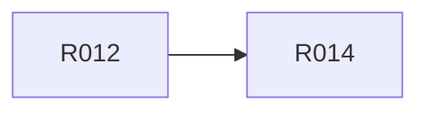

# M0 · 安全前置与工具骨架

> **本页由 `pact-book.sh` 从 `PACT.md` 自动生成，请勿手改。**
> 改内容请改 `PACT.md`，然后重新 `pact-book.sh --build`；`--check` 会抓出手改导致的漂移。

> **这是一个工作包**：本里程碑要做的全部需求、出口条件与明确不含，聚合在这一页。
> S10 施工时按此包切工作单元，取活与状态维护在 `action-graph.json`（pact-graph.sh --next）。

- **包含需求**：4 条
- **★ 强制项**：0 条

## 出口条件（全满足才算这个里程碑做完）

Core 边界、六类 schema/负例、planned provenance 与迁移冲突 fixture 全绿

## 明确不含

live 产品 evidence、物理目录切换

## 需求清单

| R-ID | ★ | 类型 | 优先级 | 需求 | 依赖 |
|---|---|---|---|---|---|
| [R001](../r/R001.md) |  | 架构 | P0 | PACT Core 零 Vima 源码依赖 | — |
| [R007](../r/R007.md) |  | 数据 | P0 | 六类治理 JSON 全部有 schema 与校验器 | — |
| [R012](../r/R012.md) |  | 追溯 | P0 | 记录来源与规范化哈希 | — |
| [R014](../r/R014.md) |  | 安全 | P0 | 导入冲突时无覆盖无删除 | R012 |

## 包内依赖图谱

