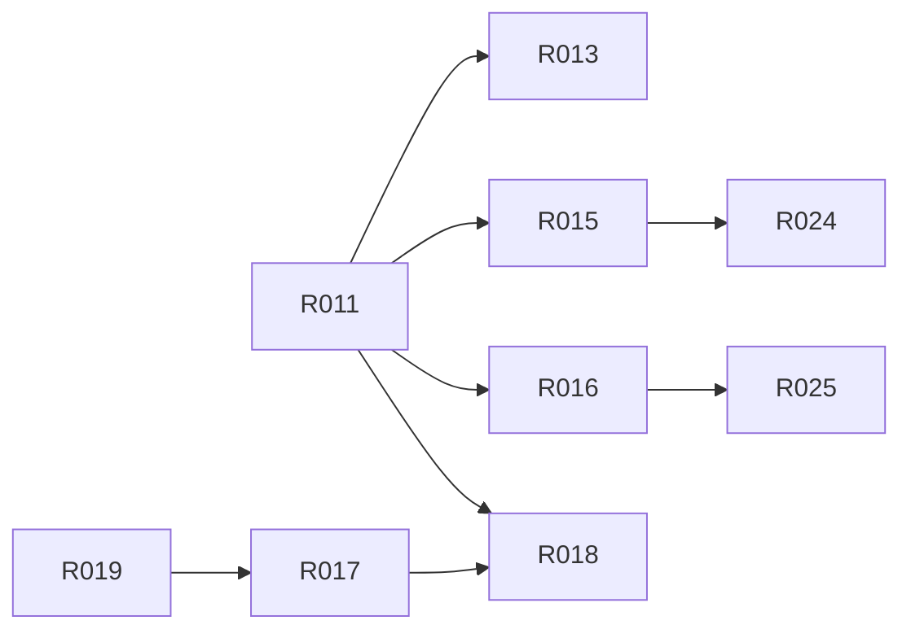

# M1 · 统一 workspace

> **本页由 `pact-book.sh` 从 `PACT.md` 自动生成，请勿手改。**
> 改内容请改 `PACT.md`，然后重新 `pact-book.sh --build`；`--check` 会抓出手改导致的漂移。

> **这是一个工作包**：本里程碑要做的全部需求、出口条件与明确不含，聚合在这一页。
> S10 施工时按此包切工作单元，取活与状态维护在 `action-graph.json`（pact-graph.sh --next）。

- **包含需求**：9 条
- **★ 强制项**：0 条

## 出口条件（全满足才算这个里程碑做完）

import manifest 先验通过；产品迁入、identity/release-unit/串行编排就位，经 linked 过渡验收后进入 canonical-only finalized；bootstrap 与两产品真实门禁全绿

## 明确不含

Starter RBAC/FullStackSpec 深化

## 需求清单

| R-ID | ★ | 类型 | 优先级 | 需求 | 依赖 |
|---|---|---|---|---|---|
| [R011](../r/R011.md) |  | 迁移 | P0 | 两产品进入约定目录 | R012⚠️ |
| [R013](../r/R013.md) |  | 边界 | P0 | 导入快照不包含闭集定义的可再生产目录 | R011 |
| [R015](../r/R015.md) |  | 兼容 | P0 | UI 包身份与公开面保持 | R011 |
| [R016](../r/R016.md) |  | 兼容 | P0 | Starter CLI 身份和模板真源保持 | R011 |
| [R017](../r/R017.md) |  | 构建 | P0 | 根级串行编排各自门禁 | R007⚠️、R019 |
| [R018](../r/R018.md) |  | 迁移 | P0 | 退役两个旧绝对路径入口 | R011、R017 |
| [R019](../r/R019.md) |  | 发布 | P0 | 三个独立 release unit | R007⚠️ |
| [R024](../r/R024.md) |  | 质量 | P0 | UI 全部门禁通过且不抬 size 阈值 | R015 |
| [R025](../r/R025.md) |  | 质量 | P0 | Starter 全部门禁与本地 pack 通过 | R016 |

> ⚠️ 标 ⚠️ 的依赖**不在本里程碑内**，必须确认它们在更早的里程碑已完成，否则本包无法开工：
>
> - [R007](../r/R007.md)（属 M0）
> - [R012](../r/R012.md)（属 M0）

## 包内依赖图谱

