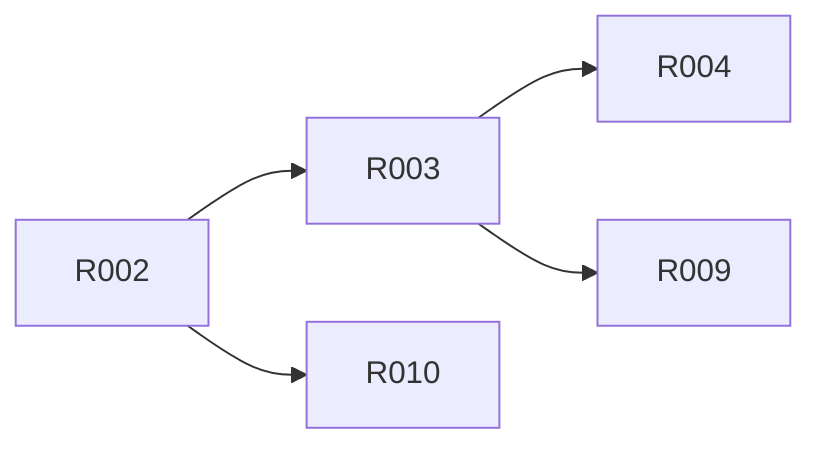

# M2 · 治理数据与能力选择

> **本页由 `pact-book.sh` 从 `PACT.md` 自动生成，请勿手改。**
> 改内容请改 `PACT.md`，然后重新 `pact-book.sh --build`；`--check` 会抓出手改导致的漂移。

> **这是一个工作包**：本里程碑要做的全部需求、出口条件与明确不含，聚合在这一页。
> S10 施工时按此包切工作单元，取活与状态维护在 `action-graph.json`（pact-graph.sh --next）。

- **包含需求**：8 条
- **★ 强制项**：0 条

## 出口条件（全满足才算这个里程碑做完）

基于迁入产品的 evidence/hash 完成 registry、profile、adapter、compatibility 与 Router 真值表

## 明确不含

新的业务生成 adapter 实现

## 需求清单

| R-ID | ★ | 类型 | 优先级 | 需求 | 依赖 |
|---|---|---|---|---|---|
| [R002](../r/R002.md) |  | 数据 | P0 | 统一声明 3 个产品能力与 2 个 adapter | R001⚠️ |
| [R003](../r/R003.md) |  | 功能 | P0 | 按需求类别选择 3 种 profile | R002 |
| [R004](../r/R004.md) |  | 架构 | P0 | Vima 在 profile 中均为可选 | R003 |
| [R005](../r/R005.md) |  | 边界 | P0 | 非法或信息不足时拒绝生成 | R007⚠️ |
| [R006](../r/R006.md) |  | 治理 | P1 | readiness 变更必须显式且有证据 | R007⚠️ |
| [R008](../r/R008.md) |  | 兼容 | P0 | 版本+哈希+契约版本+发布状态判兼容 | R007⚠️ |
| [R009](../r/R009.md) |  | 测试 | P0 | 路由基准覆盖四类输入 | R003 |
| [R010](../r/R010.md) |  | 真实性 | P0 | 不虚报 Starter 未完成能力 | R002 |

> ⚠️ 标 ⚠️ 的依赖**不在本里程碑内**，必须确认它们在更早的里程碑已完成，否则本包无法开工：
>
> - [R001](../r/R001.md)（属 M0）
> - [R007](../r/R007.md)（属 M0）

## 包内依赖图谱

