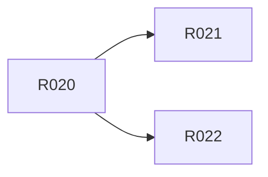

# M3 · changed release 与收尾

> **本页由 `pact-book.sh` 从 `PACT.md` 自动生成，请勿手改。**
> 改内容请改 `PACT.md`，然后重新 `pact-book.sh --build`；`--check` 会抓出手改导致的漂移。

> **这是一个工作包**：本里程碑要做的全部需求、出口条件与明确不含，聚合在这一页。
> S10 施工时按此包切工作单元，取活与状态维护在 `action-graph.json`（pact-graph.sh --next）。

- **包含需求**：6 条
- **★ 强制项**：0 条

## 出口条件（全满足才算这个里程碑做完）

changed plan/传播/错误 fixtures、3 个本地归档、PACT self-test/check/review 100%，T4 全勾

## 明确不含

外部 registry/Git 状态变更

## 需求清单

| R-ID | ★ | 类型 | 优先级 | 需求 | 依赖 |
|---|---|---|---|---|---|
| [R020](../r/R020.md) |  | 功能 | P0 | Git 路径映射直接影响单元 | R019⚠️ |
| [R021](../r/R021.md) |  | 兼容 | P0 | 依赖影响与发布影响分离 | R020 |
| [R022](../r/R022.md) |  | 数据 | P1 | release plan 稳定输出 JSON 与摘要 | R020 |
| [R023](../r/R023.md) |  | 边界 | P0 | 基线未知或归属冲突时失败 | R019⚠️ |
| [R026](../r/R026.md) |  | 质量 | P0 | PACT Core 与物料全门禁通过 | R001⚠️、R017⚠️ |
| [R027](../r/R027.md) |  | 安全 | P0 | 真实外部发布默认不可达 | R019⚠️ |

> ⚠️ 标 ⚠️ 的依赖**不在本里程碑内**，必须确认它们在更早的里程碑已完成，否则本包无法开工：
>
> - [R001](../r/R001.md)（属 M0）
> - [R017](../r/R017.md)（属 M1）
> - [R019](../r/R019.md)（属 M1）

## 包内依赖图谱

