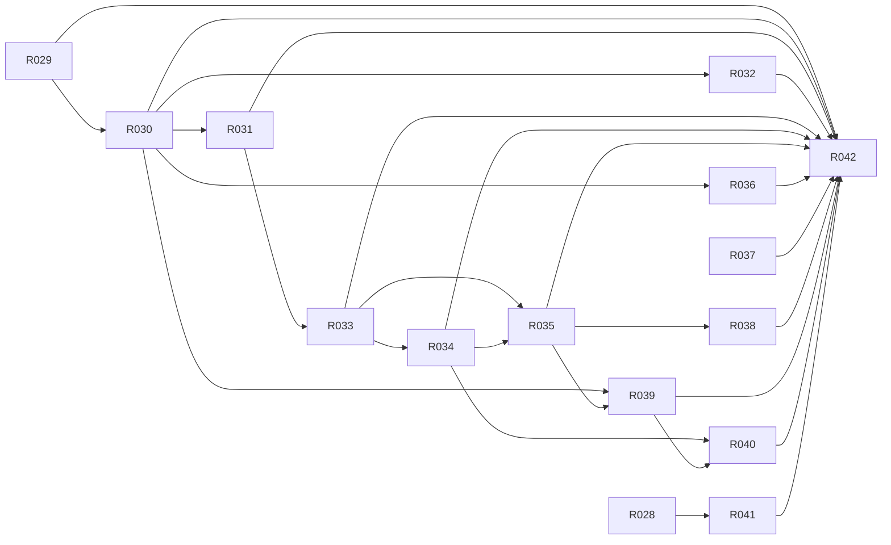

# M5 · 产品北极星与完整 npm 发行 CR

> **本页由 `pact-book.sh` 从 `PACT.md` 自动生成，请勿手改。**
> 改内容请改 `PACT.md`，然后重新 `pact-book.sh --build`；`--check` 会抓出手改导致的漂移。

> **这是一个工作包**：本里程碑要做的全部需求、出口条件与明确不含，聚合在这一页。
> S10 施工时按此包切工作单元，取活与状态维护在 `action-graph.json`（pact-graph.sh --next）。

- **包含需求**：15 条
- **★ 强制项**：0 条

## 出口条件（全满足才算这个里程碑做完）

权威文档一致；完整 tgz、CLI、manifest、Agent sync/doctor/repair、安全冲突与隔离安装全绿；根 review 重新 100%

## 明确不含

FullStackSpec、真实业务黄金切片、Starter readiness 提升、外部 npm publish

## 需求清单

| R-ID | ★ | 类型 | 优先级 | 需求 | 依赖 |
|---|---|---|---|---|---|
| [R028](../r/R028.md) |  | 产品 | P0 | 终极目标与最高判断标准进入五个权威入口 | R001⚠️ |
| [R029](../r/R029.md) |  | 发布 | P0 | 提供公开完整包 @vima-tech/pact 与两个 CLI 名 | R019⚠️ |
| [R030](../r/R030.md) |  | 交付 | P0 | 完整包携带 Core、Runtime、治理资源、Installer 和全量 Skills | R001⚠️、R029 |
| [R031](../r/R031.md) |  | 安装 | P0 | npm 安装后自动向已检测 Agent 注册全量 Skills | R030 |
| [R032](../r/R032.md) |  | 供应链 | P0 | 自动注册只使用包内同版本 Skills | R030 |
| [R033](../r/R033.md) |  | 功能 | P0 | CLI 提供 Agent 检测、同步、定向安装与验证 | R031 |
| [R034](../r/R034.md) |  | 安全 | P0 | Skill 同步路径受控且不覆盖本地修改/未知来源 | R033 |
| [R035](../r/R035.md) |  | 修复 | P0 | pact doctor 准确报告 CLI、manifest 和 Agent Skills 状态 | R033、R034 |
| [R036](../r/R036.md) |  | 兼容 | P1 | 保留 npx skills add vima-tech/pact -g 轻量全量 Skill 入口 | R030 |
| [R037](../r/R037.md) |  | 文档 | sh` 或任意搜索结果执行 | 自然语言安装只路由到官方确定性安装流程 | — |
| [R038](../r/R038.md) |  | 边界 | P0 | /pact-install/pact install 负责修复与可选环境/Adapter，不静默装重型依赖 | R035 |
| [R039](../r/R039.md) |  | 版本 | P0 | CLI、Runtime、Skills 与 manifest 同版并支持升级后再同步 | R030、R035 |
| [R040](../r/R040.md) |  | 生命周期 | P1 | 安装状态记录 PACT 精确拥有/观察的目标并支持 adopt/unadopt/remove/uninstall 安全清理 | R034、R039 |
| [R041](../r/R041.md) |  | 真实性 | P0 | 交付状态不得把低层完成冒充可用稳定业务系统 | R028 |
| [R042](../r/R042.md) |  | 质量 | P0 | 完整发行与 Agent 接入有独立自动测试和本地安装验收 | R029、R030、R031、R032、R033、R034、R035、R036、R037、R038、R039、R040、R041 |

> ⚠️ 标 ⚠️ 的依赖**不在本里程碑内**，必须确认它们在更早的里程碑已完成，否则本包无法开工：
>
> - [R001](../r/R001.md)（属 M0）
> - [R019](../r/R019.md)（属 M1）

## 包内依赖图谱

