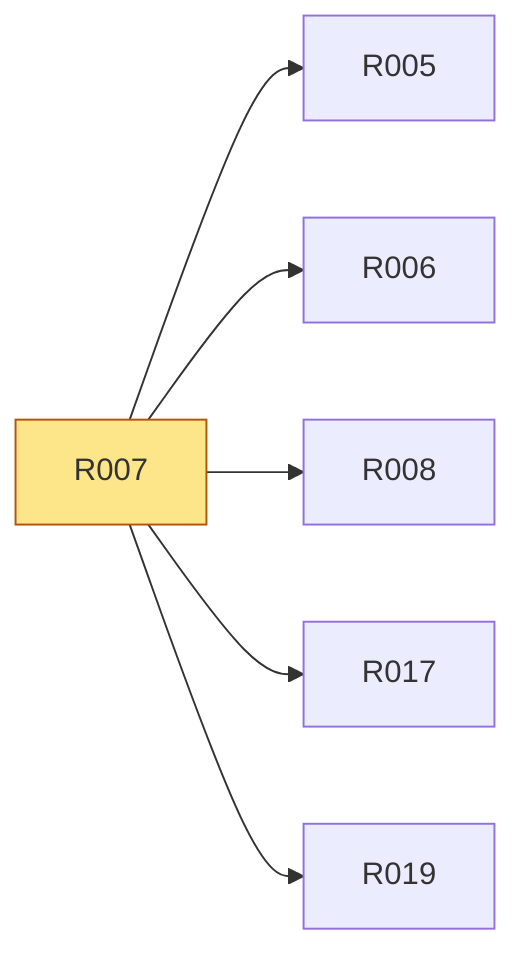

# R007 · 六类治理 JSON 全部有 schema 与校验器

> **本页由 `pact-book.sh` 从 `PACT.md` 自动生成，请勿手改。**
> 改内容请改 `PACT.md`，然后重新 `pact-book.sh --build`；`--check` 会抓出手改导致的漂移。

> **这一页是为「照着它就能开工」准备的**：把 `P5` 的需求、`T1` 的验收、依赖、
> 相关决策与契约位置聚合在一处，施工时读这一页即可，不必通读 PACT.md 全文。
> **但凡本页与 `PACT.md` 有出入，一律以 `PACT.md` 为准。**

| 项 | 值 |
|---|---|
| 类型 | 数据 |
| 优先级 | P0 |
| 里程碑 | [M0](../m/M0.md) |
| 招标强制项 | 否 |
| 所属分组 | — |
| 来源 | 设计 |

## 需求（可判真假）

六类治理 JSON 全部有 schema 与校验器

## 验收标准（可量化）

合法 fixture 全过、每类非法 fixture 至少 1 个失败

## 怎么验（`T1`）

| 验收方式 | 判定标准 | 检查者 |
|---|---|---|
| `npm run governance:check` | 六类合法 JSON 全过，每类非法 fixture 全失败 | 脚本 |

## 依赖关系

- **依赖**（要先做完这些）：无
- **被依赖**（这条不稳，下面这些都会塌）：[R005](../r/R005.md)、[R006](../r/R006.md)、[R008](../r/R008.md)、[R017](../r/R017.md)、[R019](../r/R019.md)

## 相关决策

（无直接关联的 D-ID。若施工中需要做取舍，回 `A5` 新增决策，不要就地决定。）

## 在哪些章节被提到

[P4 核心场景](../p/P4-核心场景.md)、[A2 结构与模块职责](../a/A2-结构与模块职责.md)、[T4 交付前置（Definition of Done）](../t/T4-交付前置-Definition-of-Done.md)、[T5 施工范围与里程碑](../t/T5-施工范围与里程碑.md)
