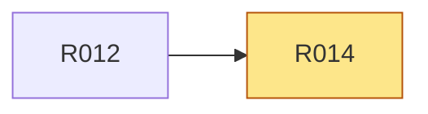

# R014 · 导入冲突时无覆盖无删除

> **本页由 `pact-book.sh` 从 `PACT.md` 自动生成，请勿手改。**
> 改内容请改 `PACT.md`，然后重新 `pact-book.sh --build`；`--check` 会抓出手改导致的漂移。

> **这一页是为「照着它就能开工」准备的**：把 `P5` 的需求、`T1` 的验收、依赖、
> 相关决策与契约位置聚合在一处，施工时读这一页即可，不必通读 PACT.md 全文。
> **但凡本页与 `PACT.md` 有出入，一律以 `PACT.md` 为准。**

| 项 | 值 |
|---|---|
| 类型 | 安全 |
| 优先级 | P0 |
| 里程碑 | [M0](../m/M0.md) |
| 招标强制项 | 否 |
| 所属分组 | — |
| 来源 | 评估 |

## 需求（可判真假）

导入冲突时无覆盖无删除

## 验收标准（可量化）

冲突 fixture 失败且源/目标 hash 不变

## 怎么验（`T1`）

| 验收方式 | 判定标准 | 检查者 |
|---|---|---|
| temp fixture conflict test | 非零退出且两端 hash 不变 | 脚本 |

## 依赖关系

- **依赖**（要先做完这些）：[R012](../r/R012.md)
- **被依赖**（这条不稳，下面这些都会塌）：无

## 相关决策

- **D002 · 没有来源 Git 历史时的导入方式** —— 采 B。  
  [看完整决策（含已否决方案）](../idx/D-ID决策索引.md#d002)
- **D005 · 旧路径兼容** —— 迁移过渡期采 C，并保留只读备份；统一入口验收完成后，本决策的“持续兼容”部分已被 D009 取代。  
  [看完整决策（含已否决方案）](../idx/D-ID决策索引.md#d005)
- **D009 · 统一入口验收后的旧别名退役** —— 采 B；linked 是可回滚过渡态，finalized 是 canonical-only 完成态。只删除两个精确软链接，.vima-*.pre-pact-20260811 快照不在本变更删除范围。  
  [看完整决策（含已否决方案）](../idx/D-ID决策索引.md#d009)

## 在哪些章节被提到

[P4 核心场景](../p/P4-核心场景.md)、[A2 结构与模块职责](../a/A2-结构与模块职责.md)、[A5 决策记录（D-ID）](../a/A5-决策记录-D-ID.md)、[T4 交付前置（Definition of Done）](../t/T4-交付前置-Definition-of-Done.md)、[T5 施工范围与里程碑](../t/T5-施工范围与里程碑.md)
