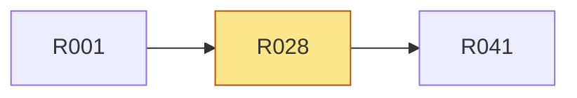

# R028 · 终极目标与最高判断标准进入五个权威入口

> **本页由 `pact-book.sh` 从 `PACT.md` 自动生成，请勿手改。**
> 改内容请改 `PACT.md`，然后重新 `pact-book.sh --build`；`--check` 会抓出手改导致的漂移。

> **这一页是为「照着它就能开工」准备的**：把 `P5` 的需求、`T1` 的验收、依赖、
> 相关决策与契约位置聚合在一处，施工时读这一页即可，不必通读 PACT.md 全文。
> **但凡本页与 `PACT.md` 有出入，一律以 `PACT.md` 为准。**

| 项 | 值 |
|---|---|
| 类型 | 产品 |
| 优先级 | P0 |
| 里程碑 | [M5](../m/M5.md) |
| 招标强制项 | 否 |
| 所属分组 | — |
| 来源 | 用户 |
| 假设 | **PACT 是控制平台，不替代 Claude Code/Codex** |

## 需求（可判真假）

终极目标与最高判断标准进入五个权威入口

## 验收标准（可量化）

根 `CLAUDE.md`、根 README、平台 README、指定设计文档与本 PACT 对目标、Agent/Pact 分工和“业务操作系统”定义一致；安装文档另验安装语义

## 怎么验（`T1`）

| 验收方式 | 判定标准 | 检查者 |
|---|---|---|
| 文档一致性测试 + 人工复核 | CLAUDE/README/platform/design/PACT 均含统一北极星、Agent/Pact 分工和业务操作系统定义 | 脚本+人 |

## 依赖关系

- **依赖**（要先做完这些）：[R001](../r/R001.md)
- **被依赖**（这条不稳，下面这些都会塌）：[R041](../r/R041.md)

## 相关决策

- **D010 · PACT 是完整 Agent 还是交付控制平台** —— 采 B；PACT 管需求、规格、图谱、能力、写入边界、证据和完成标准，推理与编码由外部 Agent 执行。  
  [看完整决策（含已否决方案）](../idx/D-ID决策索引.md#d010)

## 在哪些章节被提到

[P4 核心场景](../p/P4-核心场景.md)、[A5 决策记录（D-ID）](../a/A5-决策记录-D-ID.md)、[C11 AI / Prompt 契约](../c/C11-AI-Prompt-契约.md)、[T4 交付前置（Definition of Done）](../t/T4-交付前置-Definition-of-Done.md)、[T5 施工范围与里程碑](../t/T5-施工范围与里程碑.md)
