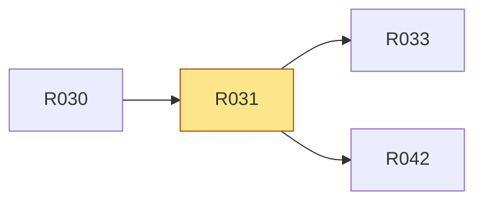

# R031 · npm 安装后自动向已检测 Agent 注册全量 Skills

> **本页由 `pact-book.sh` 从 `PACT.md` 自动生成，请勿手改。**
> 改内容请改 `PACT.md`，然后重新 `pact-book.sh --build`；`--check` 会抓出手改导致的漂移。

> **这一页是为「照着它就能开工」准备的**：把 `P5` 的需求、`T1` 的验收、依赖、
> 相关决策与契约位置聚合在一处，施工时读这一页即可，不必通读 PACT.md 全文。
> **但凡本页与 `PACT.md` 有出入，一律以 `PACT.md` 为准。**

| 项 | 值 |
|---|---|
| 类型 | 安装 |
| 优先级 | P0 |
| 里程碑 | [M5](../m/M5.md) |
| 招标强制项 | 否 |
| 所属分组 | — |
| 来源 | 用户 |

## 需求（可判真假）

npm 安装后自动向已检测 Agent 注册全量 Skills

## 验收标准（可量化）

`PACT_ALLOW_HOME_OVERRIDE=1` + `PACT_USER_HOME=<temp>` 模拟 Codex/Claude，非交互同步后每个目标恰有 manifest 所列 Skills 且验证通过，系统 HOME 不变

## 怎么验（`T1`）

| 验收方式 | 判定标准 | 检查者 |
|---|---|---|
| `PACT_ALLOW_HOME_OVERRIDE=1 PACT_USER_HOME=<temp>` Codex+Claude sync fixture | 两个 Agent 均安装 manifest 全量 Skills，verify 全 ready；不修改系统 HOME | 脚本 |

## 依赖关系

- **依赖**（要先做完这些）：[R030](../r/R030.md)
- **被依赖**（这条不稳，下面这些都会塌）：[R033](../r/R033.md)、[R042](../r/R042.md)

## 相关决策

- **D012 · npm 安装时如何获得 Skills** —— 采 B；包内 manifest 锁版本/hash，postinstall 只消费本包内容。  
  [看完整决策（含已否决方案）](../idx/D-ID决策索引.md#d012)

## 在哪些章节被提到

[P4 核心场景](../p/P4-核心场景.md)、[A2 结构与模块职责](../a/A2-结构与模块职责.md)、[A5 决策记录（D-ID）](../a/A5-决策记录-D-ID.md)、[T4 交付前置（Definition of Done）](../t/T4-交付前置-Definition-of-Done.md)、[T5 施工范围与里程碑](../t/T5-施工范围与里程碑.md)
