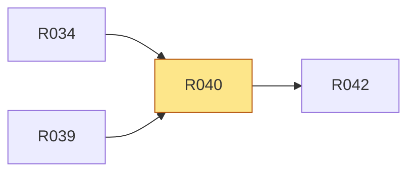

# R040 · 安装状态记录 PACT 精确拥有/观察的目标并支持 adopt/unad…

> **本页由 `pact-book.sh` 从 `PACT.md` 自动生成，请勿手改。**
> 改内容请改 `PACT.md`，然后重新 `pact-book.sh --build`；`--check` 会抓出手改导致的漂移。

> **这一页是为「照着它就能开工」准备的**：把 `P5` 的需求、`T1` 的验收、依赖、
> 相关决策与契约位置聚合在一处，施工时读这一页即可，不必通读 PACT.md 全文。
> **但凡本页与 `PACT.md` 有出入，一律以 `PACT.md` 为准。**

| 项 | 值 |
|---|---|
| 类型 | 生命周期 |
| 优先级 | P1 |
| 里程碑 | [M5](../m/M5.md) |
| 招标强制项 | 否 |
| 所属分组 | — |
| 来源 | 用户 |

## 需求（可判真假）

安装状态记录 PACT 精确拥有/观察的目标并支持 adopt/unadopt/remove/uninstall 安全清理

## 验收标准（可量化）

state 记录 agent/source/target/method/ownership/hash；remove/preuninstall 只删除仍匹配 managed，observed 只解除记录，修改项保留并出冲突报告

## 怎么验（`T1`）

| 验收方式 | 判定标准 | 检查者 |
|---|---|---|
| state/adopt/unadopt/remove/preuninstall fixtures | exact managed 删除；observed 只解除 state；修改/未知项按 `(agent,name,target)` 迁移到 uninstall-conflicts 并从 Agent state 移除；重复卸载 bytes/recordedAt 不变；双 Agent 不丢记录；删除后/conflicts 后/state 中途崩溃均可前向 recover；直接 apply 冲突 exit 5、preuninstall 转 exit 0 | 脚本 |

## 依赖关系

- **依赖**（要先做完这些）：[R034](../r/R034.md)、[R039](../r/R039.md)
- **被依赖**（这条不稳，下面这些都会塌）：[R042](../r/R042.md)

## 相关决策

- **D013 · 自动同步失败是否使 npm 安装失败** —— 采 B；包内容损坏、manifest 非法属于致命失败，未检测到 Agent、权限或本地修改属于显式可恢复状态。  
  [看完整决策（含已否决方案）](../idx/D-ID决策索引.md#d013)

## 在哪些章节被提到

[P4 核心场景](../p/P4-核心场景.md)、[A2 结构与模块职责](../a/A2-结构与模块职责.md)、[A5 决策记录（D-ID）](../a/A5-决策记录-D-ID.md)、[T4 交付前置（Definition of Done）](../t/T4-交付前置-Definition-of-Done.md)、[T5 施工范围与里程碑](../t/T5-施工范围与里程碑.md)
