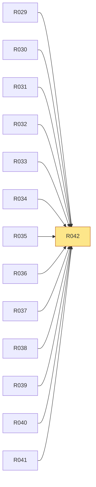

# R042 · 完整发行与 Agent 接入有独立自动测试和本地安装验收

> **本页由 `pact-book.sh` 从 `PACT.md` 自动生成，请勿手改。**
> 改内容请改 `PACT.md`，然后重新 `pact-book.sh --build`；`--check` 会抓出手改导致的漂移。

> **这一页是为「照着它就能开工」准备的**：把 `P5` 的需求、`T1` 的验收、依赖、
> 相关决策与契约位置聚合在一处，施工时读这一页即可，不必通读 PACT.md 全文。
> **但凡本页与 `PACT.md` 有出入，一律以 `PACT.md` 为准。**

| 项 | 值 |
|---|---|
| 类型 | 质量 |
| 优先级 | P0 |
| 里程碑 | [M5](../m/M5.md) |
| 招标强制项 | 否 |
| 所属分组 | — |
| 来源 | 用户 |

## 需求（可判真假）

完整发行与 Agent 接入有独立自动测试和本地安装验收

## 验收标准（可量化）

npm test 覆盖 pack/CLI/detect/sync/conflict/pending/repair/version；release pack 仍仅本地产物且全量 verify 通过

## 怎么验（`T1`）

| 验收方式 | 判定标准 | 检查者 |
|---|---|---|
| `npm test` + 两类 tgz 隔离安装 + `npm run verify` | scripts-enabled 的 `npm i -g --offline --prefix <temp-prefix> <tgz>` 设置双 home override 后自动同步；另跑 `--ignore-scripts` 后 doctor/repair；注入 pre/post-commit 崩溃、损坏 journal、多 Agent 独立恢复；根门禁全绿 | 脚本 |

## 依赖关系

- **依赖**（要先做完这些）：[R029](../r/R029.md)、[R030](../r/R030.md)、[R031](../r/R031.md)、[R032](../r/R032.md)、[R033](../r/R033.md)、[R034](../r/R034.md)、[R035](../r/R035.md)、[R036](../r/R036.md)、[R037](../r/R037.md)、[R038](../r/R038.md)、[R039](../r/R039.md)、[R040](../r/R040.md)、[R041](../r/R041.md)
- **被依赖**（这条不稳，下面这些都会塌）：无

## 相关决策

（无直接关联的 D-ID。若施工中需要做取舍，回 `A5` 新增决策，不要就地决定。）

## 在哪些章节被提到

[P4 核心场景](../p/P4-核心场景.md)、[T4 交付前置（Definition of Done）](../t/T4-交付前置-Definition-of-Done.md)、[T5 施工范围与里程碑](../t/T5-施工范围与里程碑.md)
